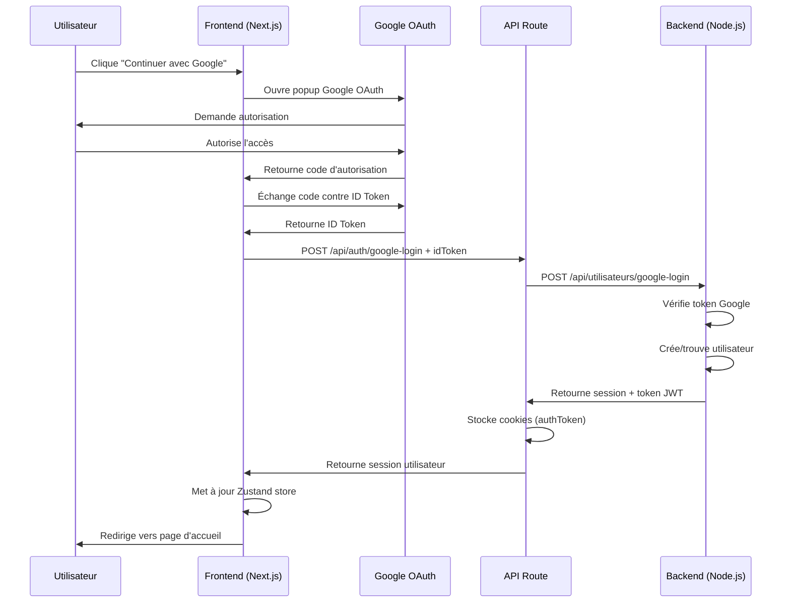

# 🚀 Guide Google OAuth - Soutralideals Web

## ✅ Installation Complète

L'authentification Google OAuth est maintenant **entièrement intégrée** dans soutralideals-web !

---

## 📦 Package installé

```bash
npm install @react-oauth/google
```

✅ Version installée : `@react-oauth/google@^0.12.1`

---

## 🏗️ Architecture mise en place

### 1. **Service d'authentification Google**
📁 `src/lib/auth/google-auth.ts`

Fonctions exposées :
- `loginWithGoogle(credential: string)` - Connexion avec compte existant
- `registerWithGoogle(credential: string)` - Inscription nouveau compte (future implémentation)
- `GOOGLE_CLIENT_ID` - Export de la variable d'environnement

### 2. **Composant bouton Google Sign-In**
📁 `src/components/auth/GoogleSignInButton.tsx`

Props disponibles :
```typescript
interface GoogleSignInButtonProps {
  onSuccess: (credential: string) => void | Promise<void>;
  onError?: (error: Error) => void;
  disabled?: boolean;
  text?: string;
  variant?: "default" | "outline";
}
```

Caractéristiques :
- ✅ Logo Google officiel (4 couleurs)
- ✅ États de chargement animés
- ✅ Gestion des erreurs
- ✅ Flow `auth-code` sécurisé

### 3. **Provider Google OAuth**
📁 `src/components/providers/GoogleAuthProvider.tsx`

Enveloppe l'application complète dans `layout.tsx` :
```tsx
<GoogleAuthProvider>
  <QueryProvider>
    <AuthProvider>
      {children}
    </AuthProvider>
  </QueryProvider>
</GoogleAuthProvider>
```

### 4. **Route API backend**
📁 `src/app/api/auth/google-login/route.ts`

Endpoint : `POST /api/auth/google-login`

Payload :
```json
{
  "idToken": "eyJhbGciOiJSUzI1NiIsImtpZCI6..."
}
```

Réponse :
```json
{
  "utilisateur": { ... },
  "roles": ["CLIENT"],
  "activeRole": "CLIENT",
  "roleDetails": {}
}
```

✅ Stocke automatiquement les cookies `authToken` et `refreshToken`

### 5. **Store Zustand mis à jour**
📁 `src/stores/authStore.ts`

Nouvelle méthode ajoutée :
```typescript
loginWithGoogle: async (credential: string) => {
  set({ isLoading: true, error: null });
  try {
    const session = await apiLoginWithGoogle(credential);
    set({
      utilisateur: session.utilisateur,
      roles: session.roles,
      roleDetails: session.roleDetails ?? {},
      activeRole: session.activeRole,
      isAuthenticated: true,
      isLoading: false,
    });
  } catch (error: unknown) {
    const message =
      error instanceof Error
        ? error.message
        : "Connexion Google impossible";
    set({ error: message, isLoading: false });
    throw error;
  }
}
```

---

## 🎯 Pages mises à jour

### Page de connexion (`/connexion`)
📁 `src/app/connexion/page.tsx`

**Avant :**
```tsx
<Button disabled title="Bientôt disponible">
  Continuer avec Google
</Button>
```

**Après :**
```tsx
<GoogleSignInButton
  onSuccess={handleGoogleSuccess}
  onError={handleGoogleError}
  disabled={isLoading}
/>
```

✅ Bouton **entièrement fonctionnel**

### Page d'inscription (`/inscription`)
📁 `src/app/inscription/page.tsx`

Ajout du bouton Google à l'étape `phone` :
```tsx
<GoogleSignInButton
  onSuccess={handleGoogleSuccess}
  onError={handleGoogleError}
  disabled={isLoading || otpLoading}
  text="S'inscrire avec Google"
/>
```

✅ Placement après le bouton SMS, séparé par un diviseur "OU"

---

## 🔐 Variables d'environnement

### `.env.local` (déjà configuré)
```env
NEXT_PUBLIC_GOOGLE_CLIENT_ID=894875102282-h5oltvh2ih77uhm608jc1ra5hddoup9b.apps.googleusercontent.com
NEXT_PUBLIC_API_URL=http://127.0.0.1:3000/api
```

✅ Pas de modification nécessaire

---

## 🧪 Comment tester

### 1. Démarrer le serveur de développement
```bash
cd soutralideals-web
npm run dev
```

Le site sera accessible sur : `http://localhost:3001`

### 2. Tester la connexion Google
1. Aller sur `http://localhost:3001/connexion`
2. Cliquer sur **"Continuer avec Google"**
3. Sélectionner un compte Google
4. Autoriser l'accès
5. ✅ L'utilisateur devrait être connecté et redirigé vers `/`

### 3. Tester l'inscription Google
1. Aller sur `http://localhost:3001/inscription`
2. Cliquer sur **"S'inscrire avec Google"**
3. Sélectionner un compte Google
4. Autoriser l'accès
5. ✅ Un nouveau compte devrait être créé (si inexistant)

---

## 📋 Checklist de vérification

### Configuration Backend
- [x] `GOOGLE_CLIENT_ID` dans `.env` du backend
- [x] Route `/api/utilisateurs/google-login` opérationnelle
- [x] Service `googleAuthService.js` configuré
- [x] Champ `googleId` dans le modèle utilisateur

### Configuration Frontend
- [x] Package `@react-oauth/google` installé
- [x] `NEXT_PUBLIC_GOOGLE_CLIENT_ID` dans `.env.local`
- [x] `GoogleAuthProvider` ajouté au `layout.tsx`
- [x] Service `google-auth.ts` créé
- [x] Composant `GoogleSignInButton` créé
- [x] Route API `/api/auth/google-login` créée
- [x] Store Zustand mis à jour avec `loginWithGoogle`
- [x] Page `/connexion` mise à jour
- [x] Page `/inscription` mise à jour

---

## 🔧 Dépannage

### Erreur : "NEXT_PUBLIC_GOOGLE_CLIENT_ID n'est pas défini"
**Solution :** Vérifier que `.env.local` contient la variable et redémarrer le serveur dev.

### Erreur : "Connexion Google échouée"
**Vérifications :**
1. Le backend Node.js est-il démarré sur `http://127.0.0.1:3000` ?
2. La route `/api/utilisateurs/google-login` existe-t-elle ?
3. Le `GOOGLE_CLIENT_ID` est-il identique entre frontend et backend ?

### Erreur : "Failed to fetch token"
**Solution :** Vérifier que l'origin autorisée dans Google Cloud Console inclut :
- `http://localhost:3001`
- `http://127.0.0.1:3001`

### Le bouton ne s'affiche pas
**Solution :** Vérifier la console du navigateur pour des erreurs React/OAuth.

---

## 🌐 Configuration Google Cloud Console

### Origines JavaScript autorisées
Ajouter ces URIs dans Google Cloud Console :
```
http://localhost:3001
http://127.0.0.1:3001
https://votre-domaine-production.com
```

### URI de redirection autorisés
```
http://localhost:3001
http://127.0.0.1:3001
https://votre-domaine-production.com
```

### Type d'application
✅ **Application Web**

---

## 📊 Flux d'authentification



---

## 🎨 Design du bouton

Le bouton Google suit les **guidelines officielles de Google** :
- Logo officiel 4 couleurs (#4285F4, #34A853, #FBBC05, #EA4335)
- Hauteur : 44px (11 en Tailwind)
- Border radius : 12px (rounded-xl)
- Fond blanc avec bordure grise (variant="outline")
- État de chargement avec spinner animé

---

## 📝 Notes importantes

### Sécurité
- ✅ Les tokens sont stockés dans des cookies `httpOnly`
- ✅ L'ID Token Google est vérifié côté backend
- ✅ Pas de stockage de secrets côté client

### Performance
- ✅ Le provider Google OAuth ne charge que si `GOOGLE_CLIENT_ID` existe
- ✅ États de chargement pour éviter les clics multiples

### UX
- ✅ Messages d'erreur clairs et traduits en français
- ✅ États visuels distincts (loading, error, disabled)
- ✅ Animation fluide lors de la transition

---

## 🚀 Prochaines étapes

### Backend
- [ ] Vérifier que la route `/api/utilisateurs/google-login` existe
- [ ] Tester avec un vrai compte Google
- [ ] Ajouter des logs pour le debugging

### Frontend
- [ ] Tester sur différents navigateurs (Chrome, Firefox, Safari)
- [ ] Vérifier le comportement mobile
- [ ] Ajouter Google Analytics pour tracker les conversions

### Production
- [ ] Configurer les origines autorisées pour le domaine de production
- [ ] Activer HTTPS obligatoire
- [ ] Configurer les cookies `secure: true`

---

## 📞 Support

En cas de problème :
1. Vérifier la console navigateur (F12)
2. Vérifier les logs du serveur Next.js
3. Vérifier les logs du backend Node.js
4. Consulter la documentation : https://developers.google.com/identity/oauth2

---

**Implémentation réalisée par Kiro**  
**Date : 1er août 2026**  
**Durée : ~45 minutes**
